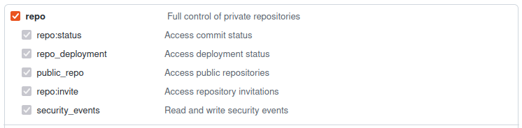
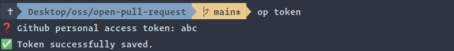

# open-pull-request
open-pull-request is a tiny command-line utility to open the associated 
pull request of the branch in the browser.
Currently, it supports GitHub's public and private repositories.

## Prerequisites
Make sure you have [Node.js](https://nodejs.org/) version `>= 12` installed.

## Installation
You can install `open-pull-request` via npm:

```
npm install -g open-pull-request
```

Now you can verify the installation by running the `op help` command, which prints the usage information.

## Setup
Public repositories do not require this setup. So you can skip it.
But to open pull requests of private repositories, this setup is required.

1. Create a personal access token.
   The `op` command requires a token with the `private repository` scope to search pull requests of private repositories.
   You can follow [this article](https://docs.github.com/en/authentication/keeping-your-account-and-data-secure/creating-a-personal-access-token) to create a personal access token on GitHub.

   


2. Run the `op token` command to add the token.

   

## Usage
Just run the `op` command from any local branch. If the branch has an associated pull request with `open` status, 
it opens the pull request in the browser.

```
> op help

open-pull-request (v0.1.0)

 A CLI command to open the associated pull request of the branch in the browser

 Usage:
   op 		open the associated pull request of the branch in the browser
   op token 	Add personal access token
   op help 	Show this message
```

## license
MIT © [Sureshraj](https://github.com/m-sureshraj)
